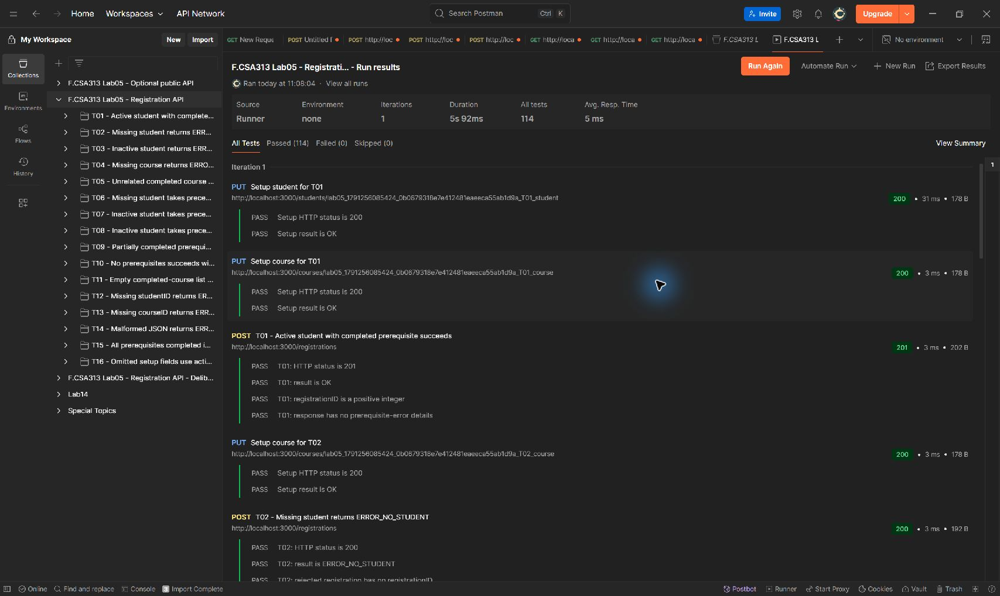
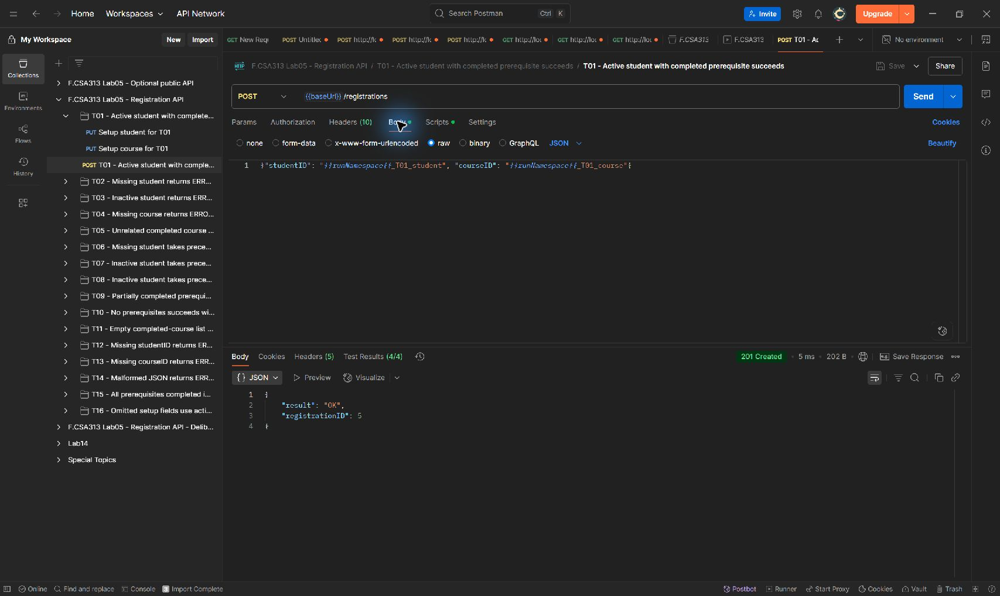
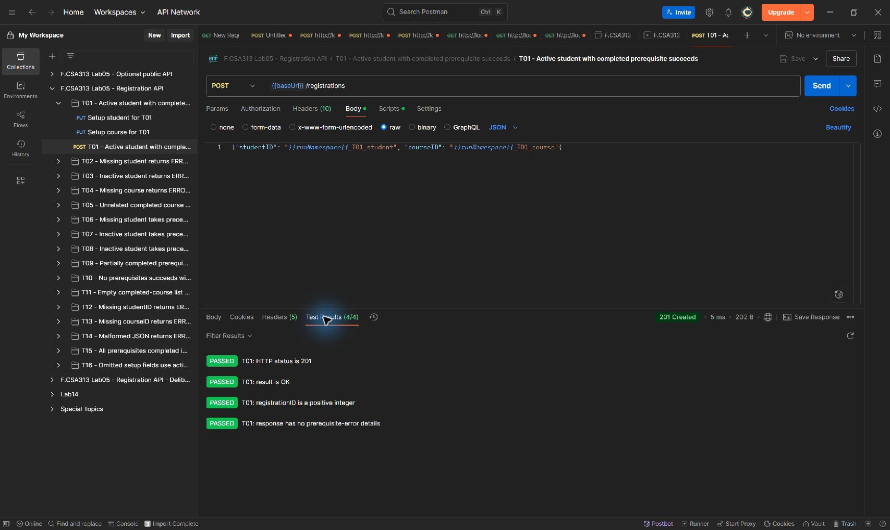
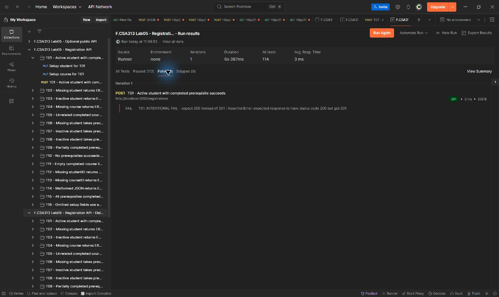
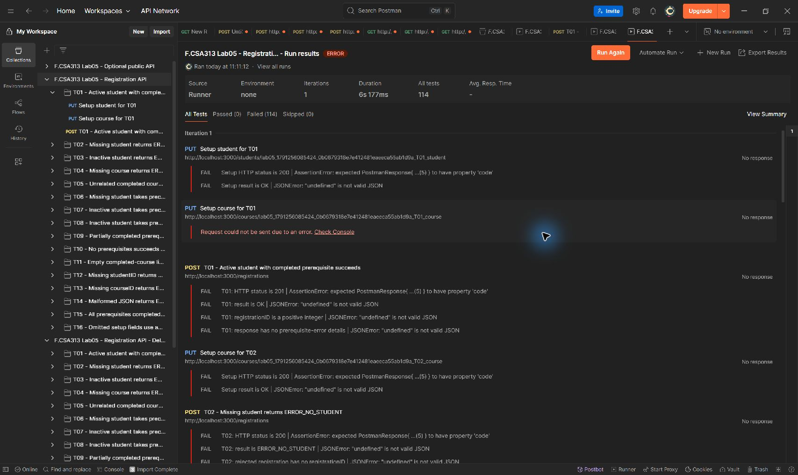
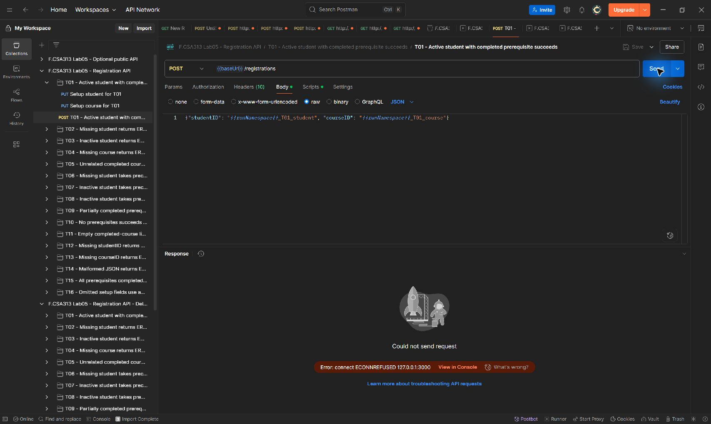
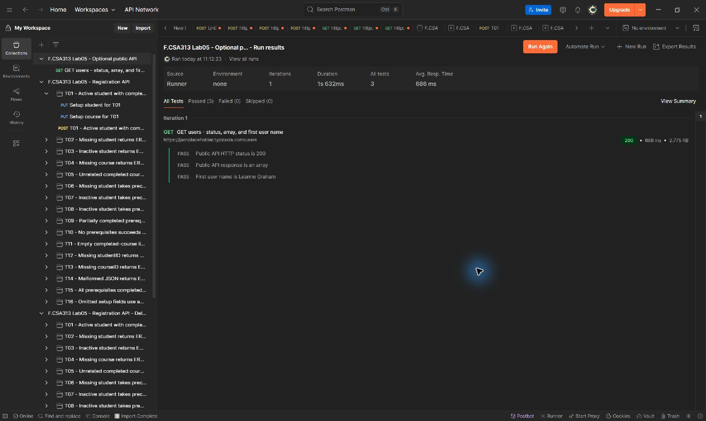

# Лаборатори №5: API систем тест - Postman ба Newman

**Хичээл:** F.CSA313 - Программ хангамжийн чанарын баталгаа ба тест
**Оюутны нэр:** М.Мөнхгэрэлт
**Оюутны код:** B232270012
**Туршилтын орчин:** Windows, PowerShell; локал API `http://localhost:3000`

Хэрэгслийн бодит хувилбарын гаралт:

```text
node -v
v24.19.0

newman -v
6.2.2
```

Хувилбар болон Newman ажиллуулалтын хураангуйг [run-summary.json](results/run-summary.json) файлд хадгалсан. Collection-ийг Postman Collection v2.1 JSON хэлбэрээр боловсруулж, Newman-аар бодитоор ажиллуулсан.

## 1. Зорилго ба тест дизайны таван алхам

Энэ ажил нь хичээлд бүртгүүлэх REST API-ийн зан төлөвийг HTTP интерфейсээр шалгаж, тестийн хүлээгдэж буй үр дүн, автомат ажиллуулалт, нотолгоог хооронд нь нийцүүлэх зорилготой.

1. **Бие даан тестлэгдэх функц:** `POST /registrations` - оюутныг хичээлд бүртгүүлэх.
2. **Сонголтууд:** оюутны төлөв, үзсэн хичээлүүд, хичээл байгаа эсэх, урьдач нөхцөл, хүсэлтийн бүтэц.
3. **Төлөөлөх утгууд:** `active`, `inactive`, байхгүй ID, `[]`, `["CS201"]`, `["CS201", "CS202"]`, талбар дутуу болон буруу JSON.
4. **Спецификаци:** T01-T16 нөхцөл бүрийн setup, HTTP статус, `result`, нэмэлт oracle-ийг урьдчилан тодорхойлох.
5. **Бодит тест кейс:** өөрийн setup PUT хүсэлтүүд, бүртгүүлэх POST хүсэлт, `pm.test` oracle-уудыг collection-ийн тусдаа хавтас бүрд хэрэгжүүлэх.

`PUT /students/:id`, `PUT /courses/:id` нь тестийн өгөгдөл бэлдэх зориулалттай. Серверийн өгөгдөл зөвхөн санах ойд хадгалагдана. Багшийн өгсөн `server.js` файлын зан төлөвийг өөрчлөөгүй.

## 2. Сонголт ба төлөөлөх утгын хүснэгт

| Сонголт | Эквивалент анги / утга | Төлөөлөх өгөгдөл | Хамрах тест |
|---|---|---|---|
| `studentID`-д харгалзах оюутны хүчинтэй байдал | Идэвхтэй / идэвхгүй / байхгүй | `status: "active"`, `status: "inactive"`, setup хийгээгүй ID | T01, T03, T02 |
| Оюутны үзсэн хичээлүүд | Урьдач нөхцөл хангана / хангахгүй | `coursesTaken: ["CS201"]` / `["CS101"]`, шаардах хичээл `["CS201"]` | T01, T05 |
| `courseID`-д харгалзах хичээлийн хүчинтэй байдал | Байгаа / байхгүй | Өөрийн PUT setup-тай хичээл / setup хийгээгүй ID | T01, T04 |
| Хичээлийн урьдач нөхцөлийн хамрагдалт | Бүгд үзсэн / огт үзээгүй / заримыг үзсэн | Шаардлага `["CS201", "CS202"]`; үзсэн нь `["CS202", "CS101", "CS201"]` / `[]` / `["CS201"]` | T15, T11, T09 |
| Урьдач нөхцөлийн тоо | Тэг / нэг / олон | `prerequisites: []` / `["CS201"]` / `["CS201", "CS202"]` | T10, T01, T09 |
| Хүсэлтийн бүтэц | Хоёр талбартай / `studentID` дутуу / `courseID` дутуу / JSON буруу | Бүрэн JSON / зөвхөн `courseID` / зөвхөн `studentID` / `{"studentID":"...","courseID":` | T01, T12, T13, T14 |
| Setup-ийн анхдагч утга | Талбаруудыг орхисон | Оюутан болон хичээлийн PUT body хоёулаа `{}` | T16 |

Оюутны үзсэн хичээлүүд болон урьдач нөхцөлийн хамрагдалт нь хоорондоо хамааралтай: хамрагдалтыг `coursesTaken` ба `prerequisites`-ийг харьцуулж тогтооно. Эдгээрийг хамааралгүй сонголт мэт бүх боломжит хослолоор үржүүлээгүй.

Боломжгүй эсвэл утгагүй хослолууд:

- Байхгүй оюутанд `active`/`inactive` төлөв болон үзсэн хичээлийн жагсаалт байхгүй тул эдгээрийг N/A гэж үзнэ.
- Байхгүй хичээлд урьдач нөхцөлийн жагсаалт тодорхойлох боломжгүй.
- `prerequisites: []` үед урьдач нөхцөл автоматаар хангагдах тул "урьдач нөхцөл дутуу" гэсэн хослол үүсэхгүй.
- Оюутан байхгүй эсвэл идэвхгүй үед хичээл болон урьдач нөхцөлийн дараагийн шалгалтууд гүйцэтгэгдэхгүй.

## 3. Спецификацийн хүснэгт

Тест бүр өөрийн `{{runNamespace}}_Txx_student`, `{{runNamespace}}_Txx_course` ID-тай. `active`/`inactive`, үзсэн болон шаардах хичээлүүдийг тухайн мөрийн setup-д тохируулна. "Байхгүй" гэж тэмдэглэсэн бичлэгт PUT хүсэлт илгээхгүй.

| ID | Оюутны setup | Хичээлийн setup | Нөхцөл / POST body | Статус | `result` | Нэмэлт хүлээлт |
|---|---|---|---|---:|---|---|
| T01 | active; үзсэн `[CS201]` | Шаардах `[CS201]` | Хоёр ID бүрэн | 201 | `OK` | Эерэг бүхэл тоон `registrationID` |
| T02 | Байхгүй | Шаардах `[CS201]` | Оюутан байхгүй | 200 | `ERROR_NO_STUDENT` | `registrationID` байхгүй |
| T03 | inactive; үзсэн `[CS201]` | Шаардах `[CS201]` | Идэвхгүй оюутан | 200 | `ERROR_INACTIVE_STUDENT` | `registrationID` байхгүй |
| T04 | active; үзсэн `[CS201]` | Байхгүй | Хичээл байхгүй | 200 | `ERROR_NO_COURSE` | `registrationID` байхгүй |
| T05 | active; үзсэн `[CS101]` | Шаардах `[CS201]` | Урьдач нөхцөл хангахгүй | 200 | `ERROR_PREREQUISITES` | `missing: ["CS201"]` |
| T06 | Байхгүй | Байхгүй | Давхар алдаа: хоёр бичлэг байхгүй | 200 | `ERROR_NO_STUDENT` | Оюутны алдаа түрүүлнэ |
| T07 | inactive; үзсэн `[CS201]` | Байхгүй | Давхар алдаа: идэвхгүй, хичээл байхгүй | 200 | `ERROR_INACTIVE_STUDENT` | Идэвхгүй төлөвийн алдаа түрүүлнэ |
| T08 | inactive; үзсэн `[]` | Шаардах `[CS201]` | Давхар алдаа: идэвхгүй, урьдач дутуу | 200 | `ERROR_INACTIVE_STUDENT` | Урьдач нөхцөлийн `missing` байхгүй |
| T09 | active; үзсэн `[CS201]` | Шаардах `[CS201, CS202]` | Урьдач нөхцөлийн заримыг үзсэн | 200 | `ERROR_PREREQUISITES` | Зөвхөн `missing: ["CS202"]` |
| T10 | active; үзсэн `[]` | Шаардах `[]` | Урьдач нөхцөлгүй хичээл | 201 | `OK` | Эерэг бүхэл тоон `registrationID` |
| T11 | active; үзсэн `[]` | Шаардах `[CS201, CS202]` | Үзсэн хичээл хоосон | 200 | `ERROR_PREREQUISITES` | `missing: ["CS201", "CS202"]` |
| T12 | Бэлтгэхгүй | Шаардах `[]` | `studentID` талбаргүй | 400 | `ERROR_BAD_REQUEST` | `registrationID` байхгүй |
| T13 | active; үзсэн `[CS201]` | Бэлтгэхгүй | `courseID` талбаргүй | 400 | `ERROR_BAD_REQUEST` | `registrationID` байхгүй |
| T14 | active; үзсэн `[CS201]` | Шаардах `[CS201]` | JSON төгсгөл дутуу | 400 | `ERROR_BAD_JSON` | Форматын алдаа бизнес шалгалтаас өмнө |
| T15 | active; үзсэн `[CS202, CS101, CS201]` | Шаардах `[CS201, CS202]` | Дараалал өөр, нэмэлт хичээлтэй | 201 | `OK` | Дарааллаас үл хамааран бүртгэнэ |
| T16 | PUT `{}` | PUT `{}` | Setup талбаруудыг орхисон | 201 | `OK` | active төлөв, хоёр хоосон массив |

Бодит тестээр баталгаажсан шалгах дараалал:

`Буруу JSON → талбар дутуу → оюутан байхгүй → оюутан идэвхгүй → хичээл байхгүй → урьдач нөхцөл дутуу → амжилт`

Энэ API-д бизнесийн алдаа `200 + ERROR_*` байдлаар буцдаг. Иймээс зөвхөн HTTP статусыг шалгах хангалтгүй; статус болон `result`-ийг тусдаа oracle-оор шалгасан.

## 4. Тестийн бие даасан байдал ба oracle

Collection-ийн `baseUrl` хувьсагч `http://localhost:3000` утгатай. `runNamespace` хоосон байвал эхний хүсэлтийн өмнөх script хугацаа болон санамсаргүй GUID ашиглан нэрийн угтвар үүсгэнэ. Newman-ы шинэ ажиллуулалт бүр экспортын хоосон утгаас эхэлнэ. Postman-д өмнөх угтвар хадгалагдсан байсан ч өөрийн PUT setup бичлэгүүдийг бүхэлд нь шинэчилдэг тул давтан ажиллуулах боломжтой.

Сценари бүр өөрийн бичлэгийг бэлддэг бөгөөд өмнөх сценариас өгөгдөл авдаггүй. Байхгүй бичлэгийн ID-г тухайн нэрийн угтварт багтааж, түүнд хэзээ ч setup хийхгүй. T06-ийн хоёр бичлэг зориуд байхгүй тул setup PUT шаардлагагүй.

PUT setup хүсэлт бүрд HTTP `200`, `result: "OK"` гэсэн хоёр oracle байна. POST хүсэлт бүрд дөрвөн oracle байна: статус, `result`, `registrationID`-ийн хэлбэр эсвэл байхгүй эсэх, мөн `missing`-ийн зөв агуулга эсвэл байхгүй эсэх. Амжилтын `registrationID`-г эерэг бүхэл тоо гэж шалгасан; `== 1` гэж шалгаагүй.

Үндсэн багц **16 сценари, 25 setup PUT + 16 POST = 41 хүсэлт, 25 × 2 + 16 × 4 = 114 assertion**-тай. README-д тайлагнасан тест/assertion-ы тоо нь **114**, Newman-ы `assertions executed` мөртэй ижил. Сценарийн тоо болон assertion-ы тоог хооронд нь сольж тооцоогүй.

T01-T16 хавтас бүрийг тусад нь сонгож ажиллуулахад бүгд амжилттай болсон; мөр бүрийн бодит тоо [run-summary.json](results/run-summary.json)-ийн `independence` хэсэгт байна. Үндсэн зөв багцыг нэг сервер дээр дахин ажиллуулж, бүртгэлийн ID хуримтлагдсан үед ч амжилттай болохыг шалгасан.

## 5. Newman-ы бодит ажиллуулалт ба нотолгоо

| Ажиллуулалт | Iterations | Requests executed | Requests failed | Assertions executed | Assertions failed | Exit code | Бүтэн гаралт |
|---|---:|---:|---:|---:|---:|---:|---|
| PASS | 1 | 41 | 0 | 114 | 0 | 0 | [newman-pass.txt](results/newman-pass.txt) |
| FAIL | 1 | 41 | 0 | 114 | 1 | 1 | [newman-fail.txt](results/newman-fail.txt) |
| DOWN | 1 | 41 | 41 | 114 | 114 | 1 | [newman-down.txt](results/newman-down.txt) |

**PASS:** үндсэн [lab05-collection.json](lab05-collection.json)-ийн бүх oracle биелсэн. Серверийг дахин асаагаагүй хоёр дахь зөв ажиллуулалтын гаралтыг эцсийн PASS нотолгоо болгон хадгалсан.

**FAIL:** [lab05-collection-fail.json](lab05-collection-fail.json) нь тусдаа collection бөгөөд зөвхөн T01-ийн статусын oracle-ийг `201`-ийн оронд `200` хүлээдэг болгон зориуд өөрчилсөн. Бодит хариу `201` байсан тул яг нэг assertion унаж, exit code `1` болсон. Үндсэн collection зөв хэвээр үлдсэн. Энэ нь oracle зөрвөл автомат чанарын хаалт амжилтгүй болохыг харуулна.

**DOWN:** зөв collection-ийг өөрийн ажиллуулсан серверийг бодитоор зогсоосны дараа ажиллуулсан бөгөөд бүтэн гаралтад `ECONNREFUSED` байна. Интерфейсийн алдаа нь сервертэй холбогдож хариу авч чадахгүй байгааг илэрхийлдэг бол oracle-ийн алдаа нь хүлээн авсан хариу хүлээлттэй зөрснийг илэрхийлнэ. DOWN үед хариу байхгүйгээс хүсэлт болон хариу шалгах assertion-ууд хоёулаа унасан; үндсэн шалтгаан нь холболтгүй байдал юм.

Текст файлууд Newman-ы stdout/stderr-ийн бүтэн гаралттай бөгөөд төгсгөлд бодит `exit=` утгыг нэмсэн. JSON reporter-ийн нэмэлт файлууд нь хүсэлт, хариу, assertion болон алдааны дэлгэрэнгүйг агуулна. Node.js-ийн deprecated API сануулгыг stderr-ээс хасалгүй хадгалсан; эдгээр нь PASS-ийн assertion алдаа биш.

### Дэлгэцийн зураг

Дараах долоон JPEG файлыг Postman Desktop App-ийн бодит цонхноос Computer Use хэрэгслээр авсан. Хүсэлтүүдийг уг программд бодитоор илгээсэн бөгөөд зургийн агуулгыг өөрчлөөгүй. Ажиллуулсан хугацаа нь 2026-10-06, Улаанбаатарын цагаар байна.

| Postman ажиллуулалт | Эхэлсэн цаг | Тэнцсэн шалгалт | Унасан шалгалт |
|---|---|---:|---:|
| PASS | 11:08:04 | 114 | 0 |
| FAIL | 11:09:53 | 113 | 1 |
| DOWN | 11:11:12 | 0 | 114 |
| Нийтийн API | 11:12:23 | 3 | 0 |

DOWN ажиллуулалтын өмнө локал серверийг зогсоож, бүх хүсэлтийг илгээхийн тулд Runner-ийн **Stop run if an error occurs** сонголтыг унтраасан. Postman-ийн үр дүнд exit code байхгүй; дээрх Newman хүснэгтэд командын бодит exit code-ийг тусад нь тайлагнасан. JPEG файлууд болон ашигласан collection файлуудын SHA-256 утга [postman-screenshot-sources.json](screenshots/postman-screenshot-sources.json) файлд байна.















Өмнөх Newman логийг браузерт харуулж авсан нэмэлт зургууд: [PASS](screenshots/newman-pass.png), [FAIL](screenshots/newman-fail.png), [DOWN](screenshots/newman-down.png), [нийтийн API](screenshots/newman-publicapi.png). Эдгээр нь хадгалсан логийн зураг бөгөөд Postman программын цонхны зураг биш. Тэдгээрийн эх сурвалж болон PNG файлын SHA-256 утгууд [screenshot-sources.json](screenshots/screenshot-sources.json) файлд байна. Бүтэн Newman логийг хэвээр хадгалсан.

## 6. Дахин ажиллуулах

Шаардлагатай хэрэгсэл нь Node.js болон Newman 6.2.2. Серверт нэмэлт сан шаардлагагүй.

```powershell
npm install -g newman@6.2.2
node -v
newman -v
node server.js
```

Өөр PowerShell цонхонд дараах командыг ажиллуулна. `$LASTEXITCODE`-ийг Newman дууссан даруйд хадгалж, `Tee-Object`-ийн төлөвтэй андуурахгүй.

```powershell
New-Item -ItemType Directory -Force results | Out-Null
newman run lab05-collection.json --reporters cli,json --reporter-json-export results/newman-pass.json --color off --disable-unicode 2>&1 | Tee-Object -FilePath results/newman-pass.txt
$runExit = $LASTEXITCODE
Add-Content -Path results/newman-pass.txt -Value "exit=$runExit"

newman run lab05-collection-fail.json --reporters cli,json --reporter-json-export results/newman-fail.json --color off --disable-unicode 2>&1 | Tee-Object -FilePath results/newman-fail.txt
$runExit = $LASTEXITCODE
Add-Content -Path results/newman-fail.txt -Value "exit=$runExit"
```

Сервер ажиллаж буй цонхонд `Ctrl+C` дарж зогсоосны дараа:

```powershell
newman run lab05-collection.json --reporters cli,json --reporter-json-export results/newman-down.json --color off --disable-unicode 2>&1 | Tee-Object -FilePath results/newman-down.txt
$runExit = $LASTEXITCODE
Add-Content -Path results/newman-down.txt -Value "exit=$runExit"
```

Postman-д **Import** ашиглан JSON collection-ийг оруулж, локал сервер ажиллаж байхад **Run collection** хийж болно. Ганц сценари шалгах жишээ:

```powershell
newman run lab05-collection.json --folder "T09 - Partially completed prerequisites report exactly the missing course"
```

Хадгалсан эцсийн лог файлууд UTF-8 кодчилолтой. Windows PowerShell 5.1-ээр дээрх командыг дахин ажиллуулаад UTF-16 файл үүсвэл логийг UTF-8 болгон хөрвүүлнэ. Дахин ажиллуулалтын дараа лог, JSON тайлан, run-summary, SHA-256 жагсаалт болон README-ийн бодит үр дүнг хамтад нь шинэчилнэ.

## 7. Нэмэлт гүнзгийрэл: нийтийн API

[lab05-publicapi-collection.json](lab05-publicapi-collection.json) нь `GET https://jsonplaceholder.typicode.com/users` хүсэлтэд HTTP `200`, хариу массив эсэх, эхний хэрэглэгчийн нэр `Leanne Graham` эсэх гэсэн гурван oracle-той. [newman-publicapi.txt](results/newman-publicapi.txt)-д **1 хүсэлт, 3 assertion, 0 failed, exit code 0** гэсэн бодит үр дүн байна. Үүнийг үндсэн багцын 114 assertion-д нэмээгүй.

Нийтийн GET API-д setup шаардлагагүй учраас локал бүртгэлийн API-аас энгийн боловч сүлжээ, гадаад үйлчилгээний хүртээмж болон өгөгдлийн өөрчлөлтөөс хамааралтай.

Заавал биш AI харьцуулалтын хэсэгт тусдаа хүний анхны дизайнтай харьцуулсан гэж тайлагнаагүй.

## 8. Дүгнэлт

Тест дизайны таван алхмаас сонголтуудыг эквивалент ангид хувааж, тэдгээрийн хамаарлыг тогтоох үе шат хамгийн их бодол шаарддаг. Оюутны үзсэн хичээлүүд болон хичээлийн урьдач нөхцөл хоорондоо хамааралтай тул бүх хослолыг шууд үржүүлэх нь утгагүй кейс үүсгэнэ. Байхгүй оюутны төлөвийг идэвхтэй гэж үзэх, урьдач нөхцөлгүй хичээлд урьдач нөхцөл дутуу гэж үзэх зэрэг хослол боломжгүй болохыг тодорхойлсон. Давхар алдааны тестүүд оюутан байхгүй болон идэвхгүй төлөвийн шалгалт нь хичээл болон урьдач нөхцөлийн шалгалтаас өмнө гүйцэтгэгддэгийг баталсан. HTTP статус болон `result`-ийг тусдаа oracle-оор шалгах нь `200` статустай бизнесийн алдааг амжилттай бүртгэлээс ялгахад шаардлагатай. Бие даасан setup болон өөрийн ID нь тестүүдийг тусад нь болон давтан ажиллуулах боломж олгосон. Сонгосон 16 сценари бүхэлдээ тэнцсэн тул эдгээрээр хамарсан зан төлөвт серверийн согог илрээгүй боловч энэ нь бүх боломжит оролтыг бүрэн шалгасан гэсэн баталгаа биш. Зориуд өөрчилсөн oracle-ийн нэг алдаа exit code `1` үүсгэж, тестийн багц зөрүүг илрүүлэн автомат чанарын хаалтад ашиглагдах боломжтойг харуулсан. Серверийг зогсоосон туршилт нь холболтын интерфейсийн алдааг хариуны утгын oracle-ийн алдаанаас ялгаж тайлбарлах бодит нотолгоо болсон.
